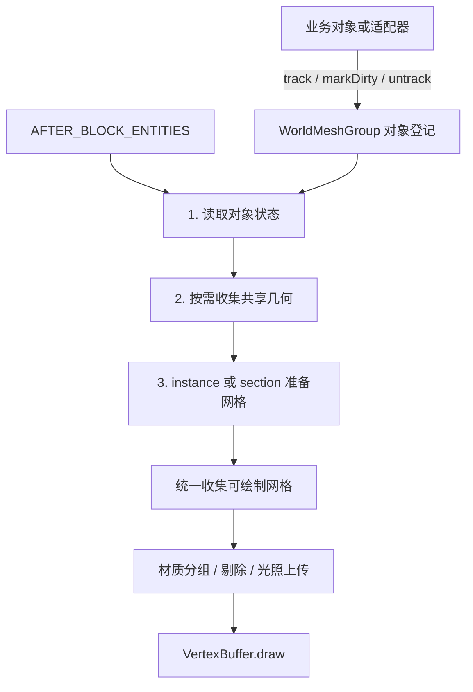

# 世界网格渲染调用链与资源归属

2026-10-07 结构更新：所有类型迁移到 `v2.client.mesh`；GPU 上传/回收归 `WorldMeshBuffers`，材质 draw/清理归世界与临时网格共用的 `MeshBatchRenderer`。包结构与接口见 [静态网格 API](static-mesh-api.md)，旧原型入口名称直接删除，GPU 句柄及辅助方法保持 public。

更新日期：2026-09-24。接入方法见 [渲染组 API](D:/Minecraft/Dev/SimpleBedrockModel/docs/world-mesh-rendering.md)。

## 主链



登记记录、缓存条目、顶点数组和 GPU 句柄是各阶段使用的数据。

完整时序：

```text
业务侧
  group.track(object, adapter)       只登记对象引用和适配器
  或 group.track(object)            使用共享的对象接口适配器

WorldMeshRenderer.onRenderStage
  同步世界身份
  WorldMeshGroup.prepareFrame
    applyPolicy                     配置 > 调用方默认值
    refreshObjects                  直接调用 adapter 的有效性与属性方法
      updateBackend                 更新策略数据；新 key 在缓存中登记捕获任务
    补齐首次准备／失效后的策略数据
    capturePending                  渲染组显式执行待捕获任务
      captureGeometry
        adapter.collectGeometry(object, collector)
      cache.finishCapture           保存结果或将失败任务放到队尾
    InstanceMeshBatches.prepare
      或 SectionMeshBatches.prepare
        仅处理已捕获的网格、上传与 active/pending 换版
  group.collect                     枚举内部已准备的绘制项
  视锥剔除、材质／网格／光照分组
  设置 shader 和共享参数
  设置实例矩阵、必要的光照更新
  VertexBuffer.draw
```

关闭静态绘制时，仍在世界渲染阶段执行对象有效性与属性检查，但跳过捕获、网格准备和绘制。

## 1. 对象登记与状态读取

渲染组使用唯一的对象身份表。每条 Entry 只保存：

- 业务对象引用、MeshRenderableAdapter 引用。
- 上一次读取的 geometryKey、origin、localTransform、packedLight、visible。
- 初始化标志、脏版本和上次轮询 tick。

Entry 没有行为转发方法。渲染组直接调用 `entry.adapter.isValid(entry.object)` 等方法。
对象直接实现 MeshRenderable 时使用一个所有对象共享的适配器，不为每个对象创建 Supplier、Predicate 或方法引用。

每次遍历先检查有效性。首次登记、主动 markDirty 或资源失效会强制读取属性；其他情况每客户端 tick 至多检查一次 needsUpdate。
属性读取完成后直接比较 Entry 中保存的字段。

渲染组不查询 BlockPos 对应的实体，也不自行采样世界光照；这些知识只在业务对象或适配器中。

## 2. 几何收集与缓存

几何缓存按调用方的不可变 geometryKey 索引。策略第一次引用未知 key 时，缓存登记一个待捕获任务；相同 key 只排一个任务。

捕获由 WorldMeshGroup.capturePending 统一调度：

1. 取出缺失几何的 key。
2. 在本轮有效对象中找到仍使用该 key 的提供者。
3. 直接调用该提供者的 collectGeometry。
4. GeometryCollector 根据实际输出归并材质和拓扑，生成 MeshSink 数据。
5. 渲染组将结果交给 GeometryCache 保存；资源暂缺返回 false 时轮转重试。

缓存按 key 保存收集结果。即使首次提供几何的对象已移除，也可使用另一个有效的同 key 对象完成捕获。
只在有待捕获任务时寻找提供者，稳态不重复收集几何。

捕获阶段每个渲染组最多尝试 4 个任务，约 2ms 软预算。任务已解除全部引用时丢弃；异常或 false 的未完成任务仍可在后续重试。
同 key 的对象必须提供等价的完整几何及材质输出，否则共享缓存本身就没有确定含义。

## 3. 两种策略的差异

| 行为 | INSTANCE | SECTION |
|---|---|---|
| GPU 几何 | 同 key 共享上传结果 | 将已捕获的局部几何拼到 section 网格 |
| 原点变化 | 更新绘制参数 | 重建受影响的 section 批次 |
| 光照变化 | 普通 pass 更新实例参数；固定发光 pass 不更新 | 普通 pass 更新该成员的局部 UV2 范围；纯发光 pass 不更新 |
| 几何 key 变化 | 等新缓存就绪后换版 | 等新 CPU 几何就绪后重建相关批次 |
| 几何收集 | 统一由渲染组执行 | 统一由渲染组执行 |

InstanceMeshBatches 为已捕获的几何排队上传。SectionMeshBatches 的 prepareMembers 接纳已捕获结果，rebuild 回放 CPU 网格。

网格准备阶段另有最多 4 项、约 2ms 的软预算。捕获与网格准备预算分别计量，不是整个渲染组的硬 2ms 上限。

## 上传与绘制

WorldMeshBuffers.submit 接收内部 MeshSink、材质和光照语义，直接计算包围盒并建立 WorldMeshPart。
上传由原版 ChunkRenderDispatcher 队列执行。未完成上传的网格不参与绘制；策略负责等待和换版。

绘制阶段按材质共享 shader 参数，逐实例更新 ModelView 矩阵并 draw。
section 的局部光照更新通过独立流上传脏范围，不改几何缓冲。

这些 GL 操作仍需要明确的上传、就绪和释放状态，不能通过删除数据记录省略。

## 哪些数据记录仍然必要

| 记录 | 保存什么 | 为什么保留 |
|---|---|---|
| WorldMeshGroup.Entry | 对象、适配器、上次属性与脏版本 | 避免重复收集并判断更新，不做方法转发 |
| GeometryCache.Entry | key、CPU 几何、共享引用数、INSTANCE GPU 网格 | 同 key 共享几何，确定缓存何时可释放 |
| 策略的 Resident／Batch／Version | 实例位置、批次成员、active/pending、光照范围 | 两种绘制策略真实存在的组织和换版状态 |
| WorldMeshPart | VBO、材质、包围盒、上传状态，SECTION 所需的光照流 | GPU 资源的内部所有权与异步上传状态 |
| WorldMeshMetrics | 累计计数、最近一帧与阶段间隔采样 | 从绘制流程分离统计状态，按需生成 WorldMeshStats 快照 |

共享引用由 GeometryCache.Entry 计数。
INSTANCE 的 GPU 句柄由缓存条目拥有，SECTION 的 GPU 句柄由批次版本拥有。资源所有者释放句柄，渲染器在上传结束后回收或关闭。
重复释放句柄无操作；世界／资源失效先标记旧句柄失效，再清理渲染组中的缓存引用，避免重复回收。

## 边界与验证

世界网格使用 AFTER_BLOCK_ENTITIES 阶段，不处理第三人称物品的完整矩阵和阴影 pass。
首次捕获、资源重载、策略迁移仍有预热窗口；section 的成员移除／显隐仍可能保留旧快照直到替换完成。
排队上传的及时释放仍依赖原版调度器完成 future，未加入主动取消机制。

验证采用编译与源码引用检查，不新增单元测试；游戏内需继续对照静态压测、定时光照、资源重载、策略切换和对象移除。
